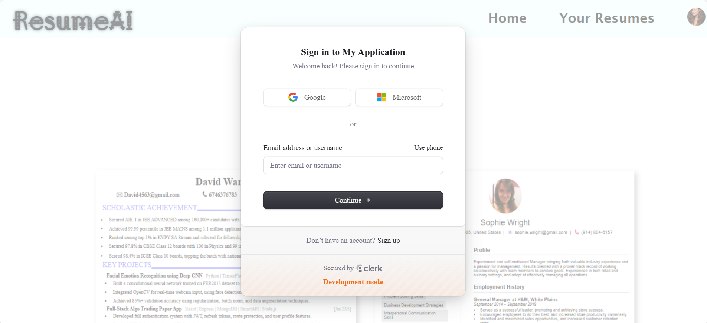
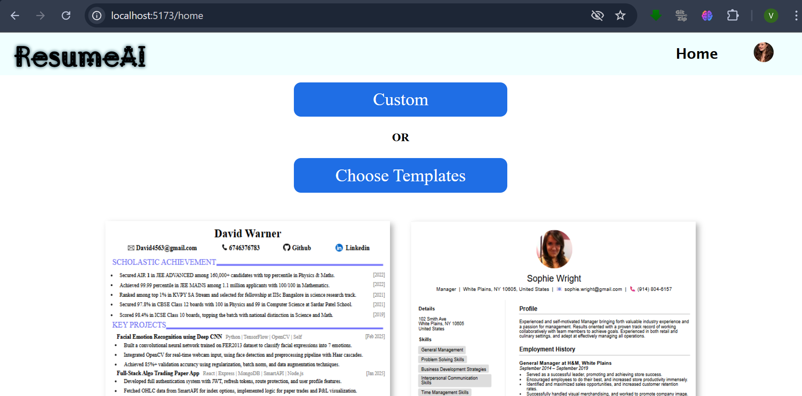
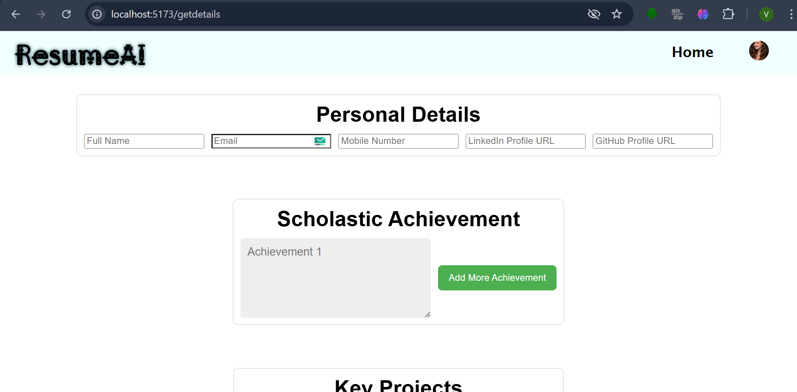
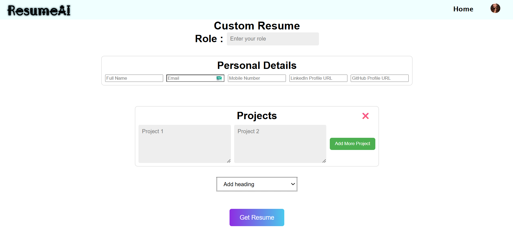
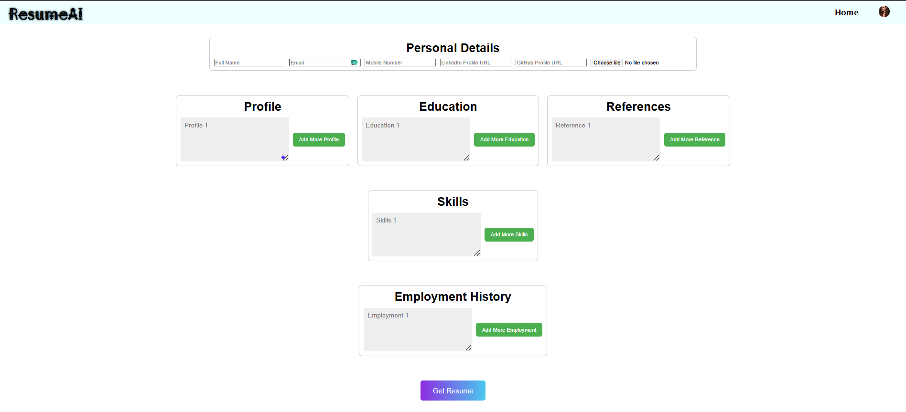
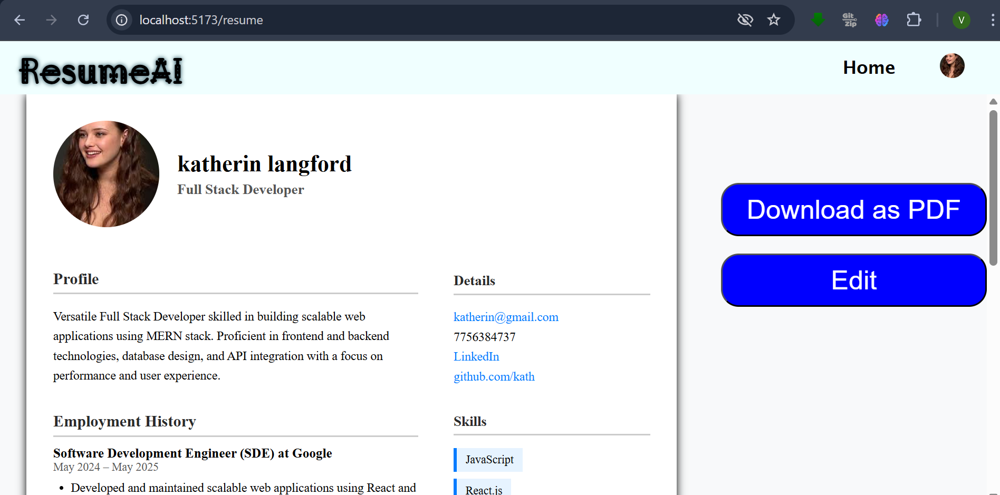

# ResumeAI

1. clone this project to your local computer
2. make account on clerk, mongodb altas, gemini and cloudinary
3. get apikey and other credential from above portal
4. paste secret key in fontend's and backend's .env file
5. open both frontend and backend in different terminal and run following command
6. npm install
7. npm run dev

[Watch Demo](https://drive.google.com/file/d/1SVG6Bw5PMs0LXYcbUHCfFHlMt2AhsXTI/view?usp=sharing)

